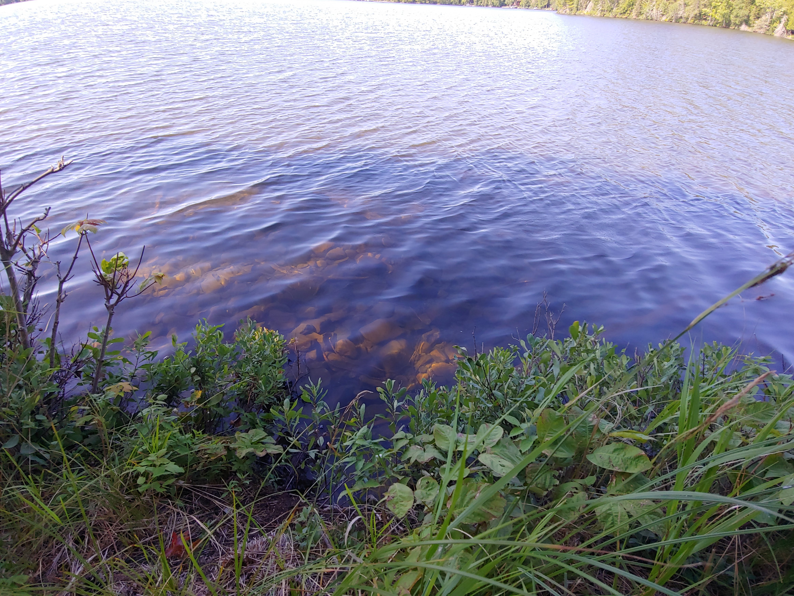
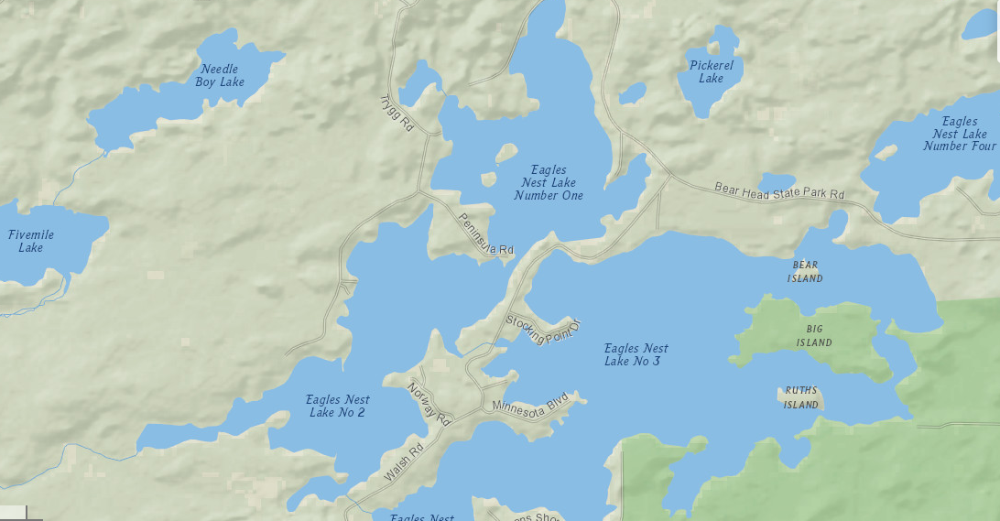

# Johnson Family Cabin

> Adventures in Northern Minnesota

## Currently

Two acres of beautiful forest, adjoining [Bear Head Lake State Park](https://goo.gl/maps/RFne5uV7ig8XQSCZ6). 

Halfway [between Tower and Ely](images/maps/Maps-MN-IronRange-Tower-Ely.PNG).

Lake shore on [Eagles Nest Lake 2](images/maps/Maps-Sat.PNG) (two for twins!)

Only [4-5 hours from White Bear Lake](images/maps/Maps-MN.PNG), on the way into [Ely](https://www.elyminnesota.com/) - see [driving directions](https://www.google.com/maps/dir/1875+County+Rd+F+East,+White+Bear+Lake,+MN+55110/47.8243368,-92.1170224/@47.7708408,-92.0482438,11.79z/data=!4m9!4m8!1m5!1m1!1s0x52b2d12f0017c993:0x4a3c9f81c6a3acc7!2m2!1d-93.021061!2d45.065259!1m0!3e0). 

## Coming Soon

Working with the builder, [Joe Gerzin](https://www.elywoodwizardsllc.com/), to build a window-front chalet, overlooking the land. 

Lower level has [2-bedrooms, 2-full baths](images/Chalet%20mod%204.jpg). Both bedrooms, "Little Finland" and "Da Norge", offer a nice jumping off spot to adventures.

Look-out loft holds carpeted "Camp Connie" - a great place for the younguns to sleep out, pitch tents, read, and plan adventures. 

Hall Hall takes you through the home to the open gathering area up front. 

## Explore!

Come see:

- The Twins - twin tall pines overlooking adventures with their beloved partners
- Lilly's Lookout - an expansive view of the adventure land
- Eden's Edge - an exciting rocky wall for climbing and fossil exploration
- Nora's Nook - a secret, special spot in the forest 
- Mount Emmett - a high spot for exploration
- Isla's Inlet - a place to drop your kayak and explore the gentle increase to deeper waters
- Madelyn Lane - a scenic drive on the way to the lake
- Marilyn's Meditation Meadow - a quiet place for reflection and gratitude
- Bruce's Backwoods - raw wilderness, home for wildlife of many species
- The Brothers - stately pines guarding the land, beloved family nearby    

## Ride the rocket!

- We'll need some help to work the land. Come ride [The Rocket](https://ranger.polaris.com/en-us/ranger-crew-570/)!

## Water Access

- Until we tame the land, come drop in kayaks, canoes, and more at the convenient boat access (just over the hill and though the woods - or a short drive) at Bear Head Lake State Park Public Access.

- Shore access provides [gentle increase out to a max depth of 36'](images/EaglesNestLake2-depth-map.PNG).

## Local Wildlife

- Lots of [bald eagles in next door Bear Head State Park](https://www.dnr.state.mn.us/birds/eagles/summer_map.html)!
- Nearby Wildlife Research Institute [Field Station](https://www.bearstudy.org/website/about-wri/field-station.html) has spotted [bears](http://bearstudy.org/website/images/stories/Documents/Living_with_Bears-in-Eagles_Nest_Township.pdf), wolves, [30 types of mammals](https://www.bearstudy.org/website/about-wri/wildlife-seen/mammals.html), 
[132 species of birds](https://www.bearstudy.org/website/about-wri/wildlife-seen/birds.html), and [more](https://www.bearstudy.org/website/about-wri/wildlife-seen/other.html).

## Nearby

- [Lake Vermillion / Tower](https://www.lakevermilionchamber.com/)
- [Ely](https://www.ely.org/)
- [Boundary Waters Canoe Area Wilderness](https://www.youtube.com/watch?v=nen7lRqEjm8)
- [Superior National Forest](https://itsallyours.us/)
- [Bear Head Lake State Park](https://www.dnr.state.mn.us/state_parks/park.html?id=spk00109#homepage)
- [Mesabi Trail](https://www.mesabitrail.com/)

## More

- [Get context](context.md)
- [Explore photos](mls.md)

