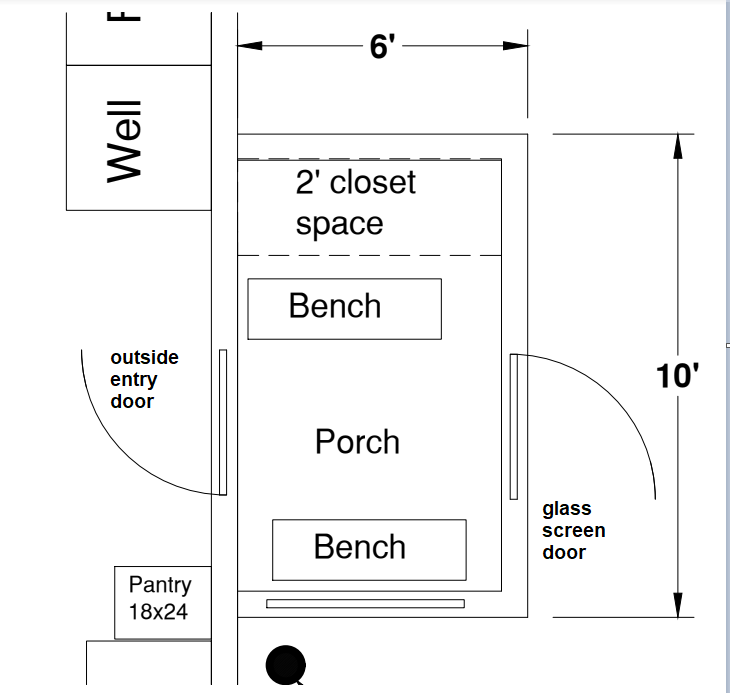
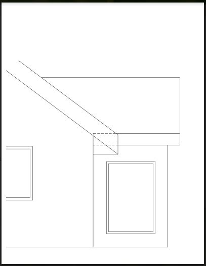

# Updated Plans and Elevations

## 4 Elevations

[1424_trygg_ely_elevation_facing_east_23-08-16.pdf](1424_trygg_ely_elevation_facing_east_23-08-16.pdf)

[1424_trygg_ely_elevation_facing_north_road_23-08-16.pdf](1424_trygg_ely_elevation_facing_north_road_23-08-16.pdf)

[1424_trygg_ely_elevation_facing_south_lake_f4_24-01-18.pdf](1424_trygg_ely_elevation_facing_south_lake_f4_24-01-18.pdf) - entry window

[1424_trygg_ely_elevation_facing_west_state_land_23-08-11.pdf](1424_trygg_ely_elevation_facing_west_state_land_23-08-11.pdf)

## Plan -  Main Level

[1424_trygg_ely_plan_main_level_24-01-17-entry_gf7.pdf](1424_trygg_ely_plan_main_level_24-01-17-entry_gf7.pdf) - entry window

## Plan - Attic Truss Upper Level

[1424_trygg_ely_plan_upper_level_attic_truss_23-08-15.pdf](1424_trygg_ely_plan_upper_level_attic_truss_23-08-15.pdf)

## Interior

[1424_trygg_ely_interior_west_wall_living_room_23-08-15.pdf](1424_trygg_ely_interior_west_wall_living_room_23-08-15.pdf)

## Entryway (2024-01-17)

## Selections

- Exterior siding color: Diamond Kote® LP® SmartSide® engineered wood siding RigidStack lap siding in **Mahogany**
- Soffit and fascia color: **Match Forest Green metal roof color or else White** -  will have white security lights on the soffit
- Roof metal color: **Forest Green**
- Exterior window color: **White**
- Interior of window (bare pine or white): **White**
- Two Exterior doors: **Matching Green with upper half windows**, 36" wide, 80" tall, 1 3/4" thick, 6-panel, insulated, steel door, with deadbolt and door handle/knob
- Overhead garage door: **Hunter Green Color**, Insulated Steel Garage Doors, Thermacore® Collection, one 2-car garage door with garage door opener, no windows, Flush Panel (5740), R-Value 17.5?
- Interior trim (bare pine or white): **White**
- Interior door (bare pine or white): **White**
- Interior door hardware finish color: **sliver, curved lever style**
- Cabinets: Omega, White, [visualizer](https://www.omegacabinetry.com/style-design/learn-about-cabinetry/cabinet-finishes/kitchen-visualizer), [tips](https://www.rtacabinetsreviews.com/omega-cabinets-reviews-prices-and-tips/)
- Flooring: Mohawk, Light wood color, varied, narrow boards, white trim, NOT SLIPPERY, easy to clean, water resistant, scratch resistant, thicker padding, 12 mil or 20 mil wear layer.
- Home » Flooring » Laminate » Products » Mannington Restoration Collection® Black Forest Oak [Weathered 22201](https://www.floortoceilingvirginia.com/flooring/laminate/products/mannington-restoration-collection-black-forest-oak-weathered-22201/) or [Antiqued 22200](https://www.floortoceilingvirginia.com/flooring/laminate/products/mannington-restoration-collection-black-forest-oak-antiqued-22200/)

## Flooring

- Mohawk PureTech uses Uniclic®
- Mohawk RevWood uses Uniclic®
- Mohawk SolidTech uses Uniclic®, clicked together quickly and simply, tongue and groove.
- Mohawk TecWood - any glue, nail, staple or float
- Mohawk UltimateFlex versatile, durable and 100% waterproof luxury vinyl tile and plank flooring. Perfect for damp areas like kitchens and baths, high traffic areas and multi-level living, the glue-down flooring installs easily and allows for replacement of individual planks, saving time and money. UltimateFlex goes down fast and stays down longer for truly hassle-free flooring.
- Mohawk RevWood Plus - Pet Friendly Laminated Wood - scratch resistant
- Mohawk Home 12MM Thick x 6.14in x 47.25in Laminate Wood Plank Flooring (18.14 sq ft/ctn)
  - SplashDefense® Waterproof Surface and Water-tight Joints
  - CleanProtect® Technology with Antimicrobial Properties Built in to Protect the Floor
  - 10mm Plank + 2mm Attached Pad​ and Patented Uniclic Joint for Fast, Easy Installation. No Underlayment Required
  - Lifetime Limited Residential and 10 yr. Light Commercial Warranty
  - Material cost about Price Per SQ FOOT: $2.04 at Costco
  - Color: Ridgeway Hickory
 
  - Floor to Ceiling [Mohawk Plank](https://www.floortoceilingvirginia.com/flooring/vinyl/products/?_brand=mohawk&_shape=plank)
    - If Dodford 20 Click, 4.2 Mm, [Bordeaux Oak](https://www.floortoceilingvirginia.com/flooring/vinyl/products/mohawk-dodford-20-click-multi-strip-bordeaux-oak-dfd03-220/)
    - If Dodford 20 Dry Back, 2.5 Mm, [Bordeaux Oak](https://www.floortoceilingvirginia.com/flooring/vinyl/products/mohawk-dodford-20-dry-back-multi-strip-bordeaux-oak-dfd01-220/)
    - If Amber Escape, [Foley](https://www.floortoceilingvirginia.com/flooring/vinyl/products/mohawk-amber-escape-multi-strip-foley-sdp07-286/) or Finley
    - If Bowman, [Adobe Brown](https://www.floortoceilingvirginia.com/flooring/vinyl/products/mohawk-bowman-multi-strip-adobe-brown-c0077-96/) or Sand Castle or Harvest Wheat
    - If Poppy Reserve, [Sanibel](https://www.floortoceilingvirginia.com/flooring/vinyl/products/mohawk-poppy-reserve-multi-strip-sanibel-sdp06-847/)
    - Not Batavia II (too dark)
    - Not Bedford (too dark)
    - If Brennan 2mm, [Magnolia is very consistent color](https://www.floortoceilingvirginia.com/flooring/vinyl/products/mohawk-brennan-2mm-multi-strip-magnolia-cc003-sc737/)
    - Mannington Adura Apex Nordic Oak, 3x price?, likely too expensive, [Cabin](https://www.floortoceilingvirginia.com/flooring/vinyl/products/mannington-aduraapex-nordic-oak-cabin-apx111/) or [Chalet](https://www.floortoceilingvirginia.com/flooring/vinyl/products/mannington-aduraapex-nordic-oak-chalet-apx110/)

- Home » Flooring » Laminate » Products » Mannington Restoration Collection® Black Forest Oak [Weathered 22201](https://www.floortoceilingvirginia.com/flooring/laminate/products/mannington-restoration-collection-black-forest-oak-weathered-22201/) or [Antiqued 22200](https://www.floortoceilingvirginia.com/flooring/laminate/products/mannington-restoration-collection-black-forest-oak-antiqued-22200/)

## Images

Example of siding color and roof color:

Example of exterior doors (except one 2-car door with flush panels):

Overhead garage door (hunter green, no windows, flush panels):

Overhead garage door (just for illustration of flush panels):

Example of interior door handles:

Example of light, wood-colored flooring color with white trim (first choice, thinner boards are fine):

Example of another flooring color with white trim (also good):

Example of white Omega cabinets:

Example of the kitchen layout we hope to recreate (except white cabinets with lighter wood flooring):

The Old Clusiau Cabin (from childhood):

