# Updated Plans and Elevations

## 4 Elevations

[1424_trygg_ely_elevation_facing_east_23-08-16.pdf](1424_trygg_ely_elevation_facing_east_23-08-16.pdf)

[1424_trygg_ely_elevation_facing_north_road_23-08-16.pdf](1424_trygg_ely_elevation_facing_north_road_23-08-16.pdf)

[1424_trygg_ely_elevation_facing_south_lake_f4_24-01-18.pdf](1424_trygg_ely_elevation_facing_south_lake_f4_24-01-18.pdf) - entry window

[1424_trygg_ely_elevation_facing_west_state_land_23-08-11.pdf](1424_trygg_ely_elevation_facing_west_state_land_23-08-11.pdf)

## Plan -  Main Level

[1424_trygg_ely_plan_main_level_24-04-10-prior_bath_gf9.pdf](1424_trygg_ely_plan_main_level_24-04-10-prior_bath_gf9.pdf) - main bath (original) with doors

## Plan - Attic Truss Upper Level

[1424_trygg_ely_plan_upper_level_attic_truss_24-03-04_a7.pdf](1424_trygg_ely_plan_upper_level_attic_truss_24-03-04_a7.pdf) - add door to bedroom at top of stairs

## Interior

[1424_trygg_ely_interior_west_wall_living_room_23-08-15.pdf](1424_trygg_ely_interior_west_wall_living_room_23-08-15.pdf)

## Selections

Exterior siding color: Diamond Kote® LP® SmartSide® engineered wood siding RigidStack lap siding in **Mahogany**

Soffit and fascia color: **White** -  will have white security lights on the soffit (updated 3/14/24)

Roof metal color: **Forest Green**

Exterior window color: **White**

Interior of window (bare pine or white): **White**

Two Exterior doors: **Similar Green with upper half windows**, 36" wide, 80" tall, 1 3/4" thick, 6-panel, insulated, steel door, with deadbolt and door handle/knob

Overhead garage door: **Hunter Green Color**, Insulated Steel Garage Doors, Thermacore® Collection, one 2-car garage door with garage door opener, no windows, Flush Panel (5740), R-Value 17.5?

Interior trim (bare pine or white): **White**

Interior door (bare pine or white): **White**

Interior door hardware finish color: **sliver, curved lever style**

Cabinets: Omega, White, [visualizer](https://www.omegacabinetry.com/style-design/learn-about-cabinetry/cabinet-finishes/kitchen-visualizer), [tips](https://www.rtacabinetsreviews.com/omega-cabinets-reviews-prices-and-tips/)

Counters: Likely reasonably cost-effective granite.

Carpet: [Parade I - 406 Ivory Tower](https://www.floortoceilingvirginia.com/flooring/carpet/products/dream-weaver-parade-ivory-tower-8265_406/)

Flooring: [Responsive Allure Hickory Knob](https://flooringmarket.com/collections/responsive-allure/products/responsive-allure-hickory-knob), 22 mil, 7", 48", 10 , 21.02 Sq.Ft/Carton

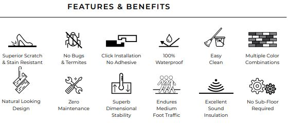

Bathroom - downstairs - molded shower with sliding glass door - Like this [HD Option](https://www.homedepot.com/p/Ella-Liberty-60-in-x-33-in-x-77-in-AcrylX-1-Piece-Shower-Wall-and-Shower-Pan-in-White-with-3-Loose-Grab-Bars-Left-Seat-E-6032LWH-PKG1SS/)

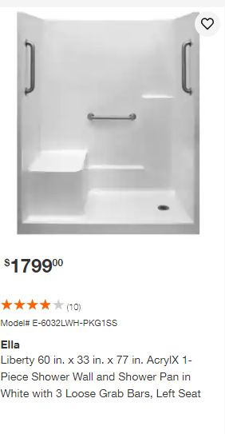

[main shower doors](images/main_shower_sliding_glass_door.png)

Bathroom - upstairs

## Images

Example of siding color and roof color:

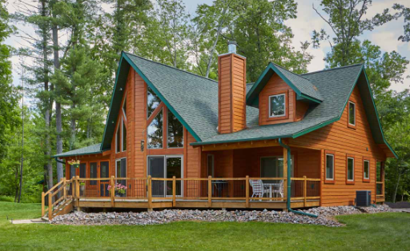

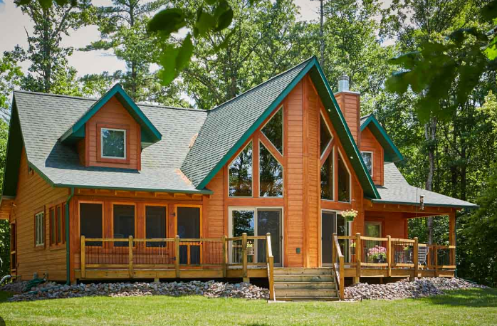

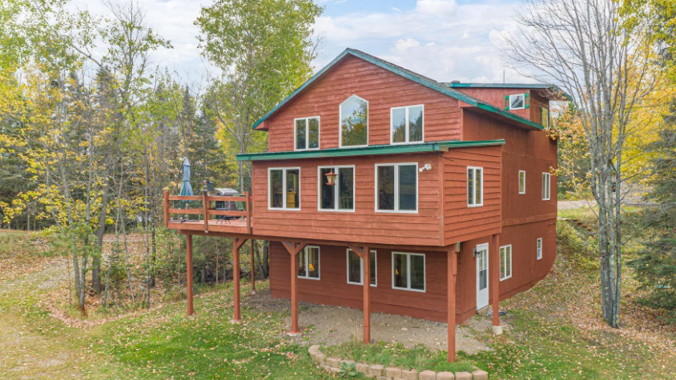

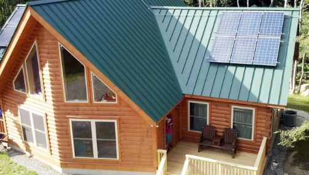

Example of exterior doors (except one 2-car door with flush panels):

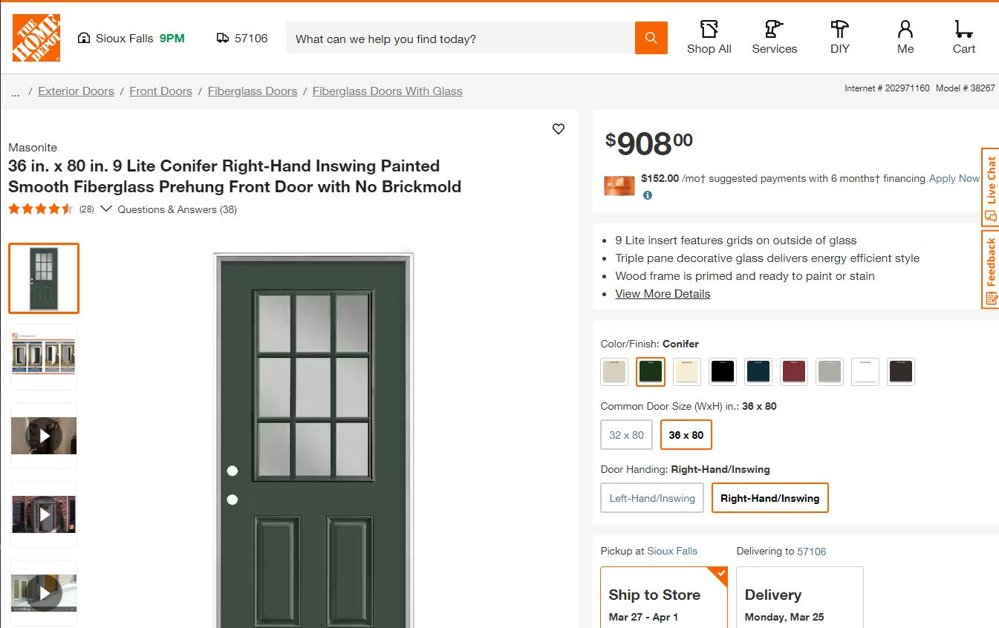

Overhead garage door (hunter green, no windows, flush panels):

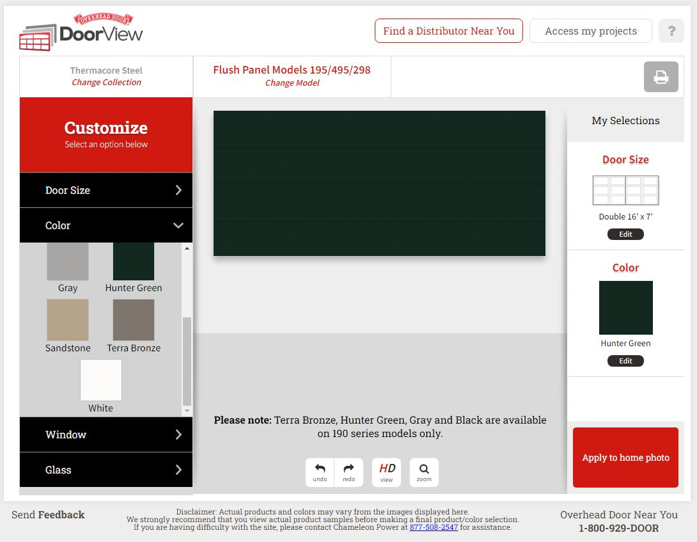

Overhead garage door (just for illustration of flush panels):

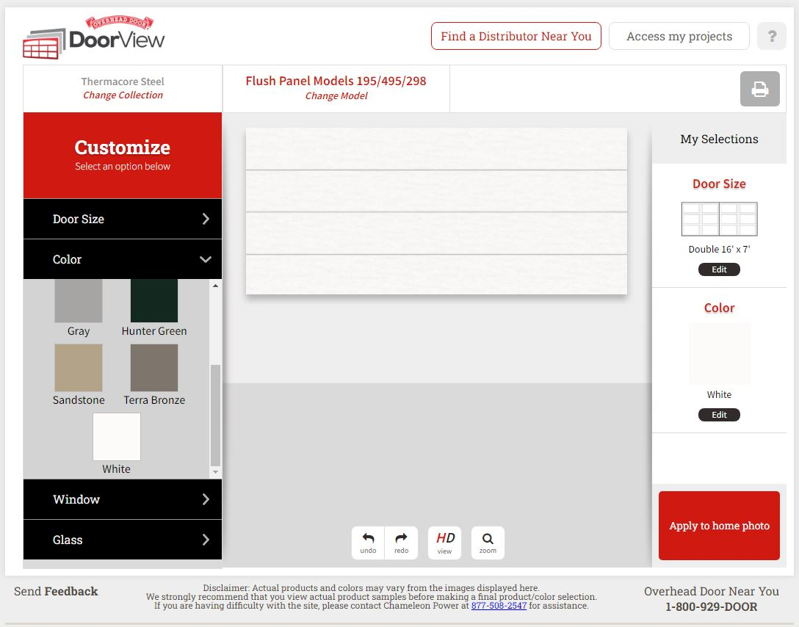

Example of interior door handles:

Example of light, wood-colored flooring color with white trim (first choice, thinner boards are fine):

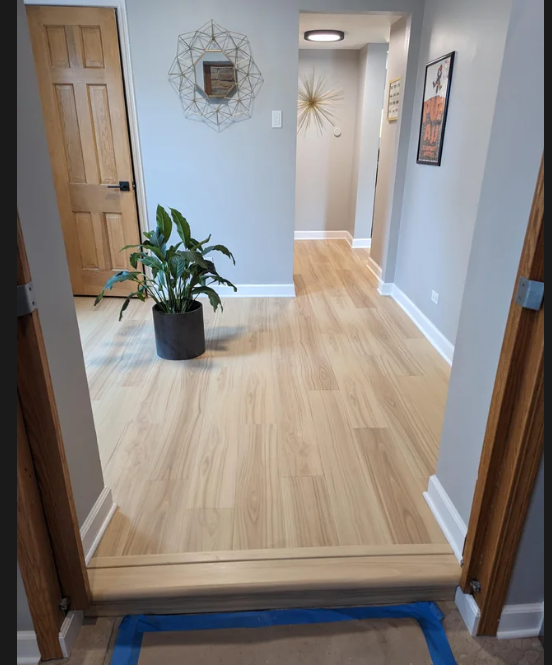

Example of another flooring color with white trim (also good):

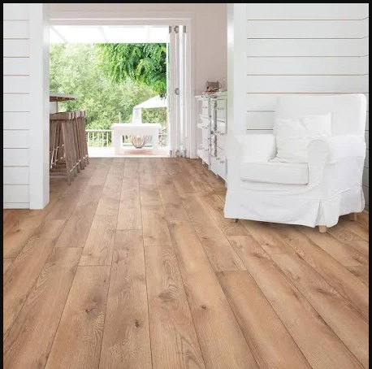

Example of white Omega cabinets:

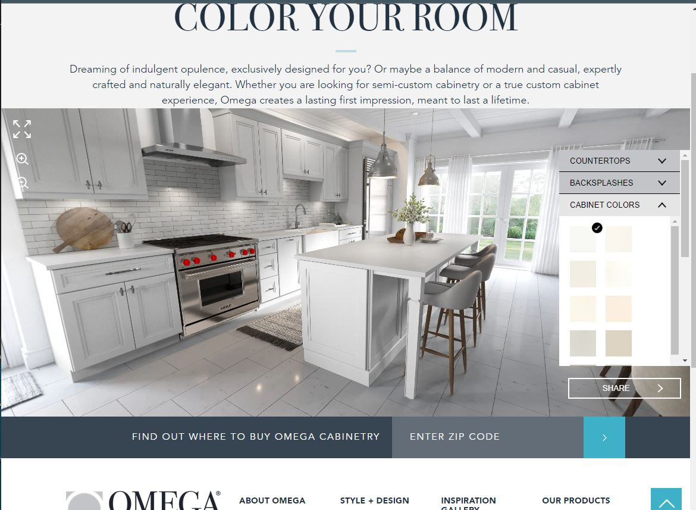

Example of the kitchen layout we hope to recreate (except white cabinets with lighter wood flooring):

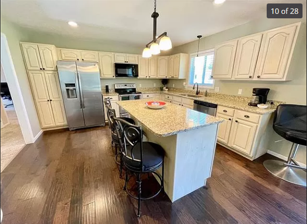

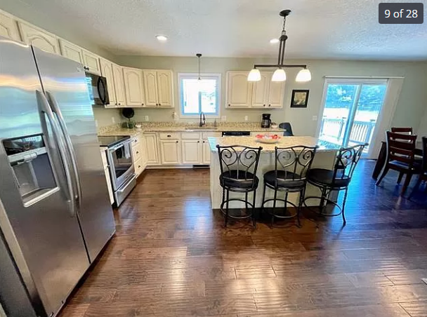

The Old Clusiau Cabin (from childhood):

